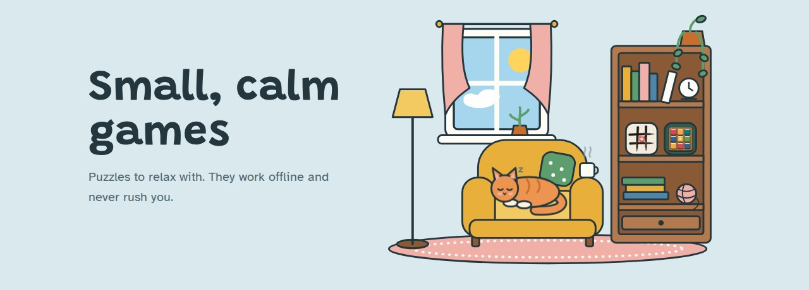
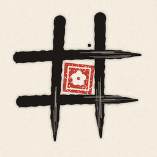
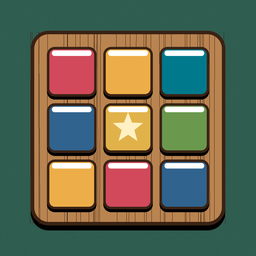

<h1 align="center">Kitefold Games</h1>

<b>Small, calm games.</b> Puzzles to relax with. Offline, no account, one optional purchase.

<a href="https://kitefoldgames.com"><b>kitefoldgames.com</b></a> · <a href="https://kitefoldgames.com/support.html">Support</a> · <a href="https://kitefoldgames.com/privacy.html">Privacy</a>

> **Latest update (2.3, 2026-10-10):** New, brighter look: a reading corner with a window, a bookshelf, an armchair and a sleeping cat you can pet.

## Our games

| | Game | | Status |
|---|---|---|---|
|  | **[Sudoku: Ink & Paper](https://kitefoldgames.com/sudoku/)** | Classic logic puzzles in ink | Out on iPhone in October 2026 · [App Store](https://apps.apple.com/app/id6819167276) |
|  | **[Grainfit: Wood Block Puzzle](https://kitefoldgames.com/grainfit/)** | Rotate, fit & clear the board | Out on iPhone in October 2026 · [App Store](https://apps.apple.com/app/id6820693702) |

Stores: App Store (iPhone); coming soon to Google Play, Galaxy Store, Huawei AppGallery and Xiaomi GetApps. New games are added on their release day.

## In your language

Every game, and this site, is available in 14 languages. Visitors are sent to their own language on their first visit and can switch from the globe menu at any time.

[English](https://kitefoldgames.com/) · [Türkçe](https://kitefoldgames.com/tr/) · [Español](https://kitefoldgames.com/es/) · [Português (Brasil)](https://kitefoldgames.com/pt-br/) · [Português (Portugal)](https://kitefoldgames.com/pt-pt/) · [Français](https://kitefoldgames.com/fr/) · [Deutsch](https://kitefoldgames.com/de/) · [Italiano](https://kitefoldgames.com/it/) · [Polski](https://kitefoldgames.com/pl/) · [Русский](https://kitefoldgames.com/ru/) · [العربية](https://kitefoldgames.com/ar/) · [简体中文](https://kitefoldgames.com/zh/) · [日本語](https://kitefoldgames.com/ja/) · [한국어](https://kitefoldgames.com/ko/)

## About this site

This repository is the studio website, served by GitHub Pages at [kitefoldgames.com](https://kitefoldgames.com).

- Plain static HTML and CSS, no framework and no trackers or analytics
- The home page picture is drawn in SVG: a reading corner with a window, a bookshelf, an armchair and a sleeping cat. The window follows the visitor's time of day, and tapping the cat wakes it up
- English lives at the root; every other language has its own folder (`/tr/`, `/de/`, `/ja/` ...) with the home page, a page per game and the support page
- Fonts are hosted on the site itself
- A soft lo-fi track plays in the background. Browsers only allow sound after the first tap or click, so it starts then, and it keeps its place from page to page. The track is generated in code, so it's free of third-party licenses
- Only released games are shown
- `app-ads.txt` at the root authorises the AdMob account used in the games

## Changelog

### 2.3 · 2026-10-10
- New, brighter look: a reading corner with a window, a bookshelf, an armchair and a sleeping cat you can pet
- The window follows your time of day, and the lamp switches on in the evening
- Games now stand on wooden shelves, with shorter and simpler texts
- Store list adds Google Play, Galaxy Store, Huawei AppGallery and Xiaomi GetApps as coming soon

### 2.2 · 2026-10-10
- Grainfit: Wood Block Puzzle joins the shelf with its own page, App Store button, gameplay video and six screenshots
- The site now speaks the same 14 languages as the games, with a globe menu and automatic language on the first visit
- The lo-fi music plays on its own as you browse (no more radio button) and keeps its place from page to page
- Only released games are shown; the locked tiles are gone
- Added sitemap.xml and robots.txt

### 2.1 · 2026-10-08
- Company email addresses: support@, privacy@ and hello@kitefoldgames.com, shown on the support and privacy pages and in the footer

### 2.0 · 2026-10-08
- New evening theme: dusk sky, lit rooftops and a paper kite that sways on its string
- Games that aren't out yet sit on the shelf locked and blurred; tap one and it shakes
- Lo-fi radio: a soft looping track with rain and vinyl crackle, started from the header
- Sudoku: Ink & Paper gets an App Store button, a gameplay video and six screenshots
- Moved to kitefoldgames.com; fonts are now served from the site itself

### 1.0 · 2026-10-05
- First version: a page per game, privacy policy in English and Turkish, support page and app-ads.txt

---

This README is generated together with the site by <code>tools/make_site.py</code>. © 2026 Kitefold Games.
